# Manual de usuario

## LQP HiFi Rack Player 4.0 — World Edition

Este manual explica la instalación, la reproducción de archivos locales, el ecualizador manual, la ecualización asistida por NVIDIA, las memorias de EQ, las radios argentinas e internacionales, la grabación, el analizador de espectro y la configuración de salida de audio.

> La interfaz está pensada como un rack Hi-Fi de fines de los 80 y principios de los 90, pero el procesamiento de audio es digital y funciona en tiempo real.

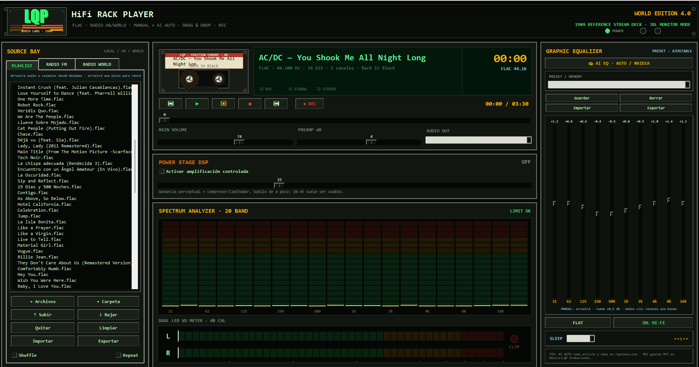

## 1. Requisitos

### Sistema recomendado

- Windows 10 u 11 de 64 bits.
- Python 3.11 o superior, instalado desde Python.org.
- Tcl/Tk incluido en la instalación de Python.
- Salida de audio compatible con Windows.
- Conexión a internet para radios, búsqueda de emisoras, descarga inicial de FFmpeg y AI EQ.

### Dependencias principales

La aplicación usa NumPy, SciPy, SoundDevice, Requests, Pillow, Mutagen y TkinterDnD2. FFmpeg se utiliza para decodificar formatos de audio, abrir streams de radio y grabar emisoras.

## 2. Instalación

### Opción recomendada

1. Descargá o cloná el repositorio.
2. Abrí PowerShell dentro de la carpeta.
3. Instalá las dependencias:

```powershell
py -3 -m pip install -r requirements.txt
```

4. Ejecutá:

```powershell
py -3 src\lqp_hifi_rack_player.py
```

También podés hacer doble clic en `run_windows.bat`.

### Primera ejecución

Si falta una dependencia, la aplicación intenta instalarla. Si FFmpeg no está disponible en el sistema, intenta descargar una versión portable en la carpeta de datos locales del usuario. La primera apertura puede tardar más que las siguientes.

## 3. Recorrido general de la interfaz

La pantalla está dividida en tres zonas:

- **SOURCE BAY**, a la izquierda: playlist, radios argentinas y radios internacionales.
- **Deck y procesamiento**, en el centro: cassette, display, transporte, volumen, preamplificador, Power Stage DSP, espectro y VU.
- **Graphic Equalizer**, a la derecha: ecualización manual, presets, memorias, AI EQ y sleep timer.

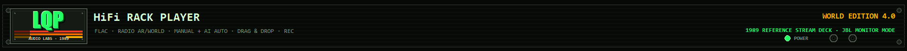

La franja superior muestra el nombre del producto, la edición instalada y los indicadores principales del sistema.

## 4. Playlist y archivos locales

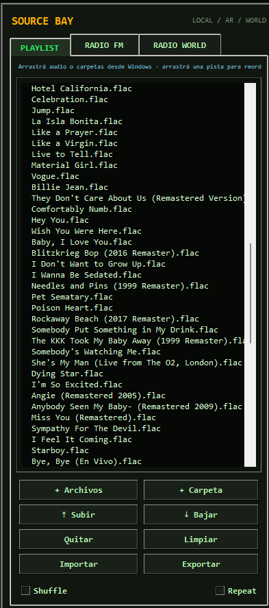

### Agregar música

Tenés tres formas de cargar contenido:

1. **+ Archivos**: selecciona uno o varios archivos.
2. **+ Carpeta**: recorre una carpeta y sus subcarpetas buscando audio compatible.
3. **Arrastrar y soltar**: arrastrá archivos o carpetas desde el Explorador de Windows hacia la lista.

La aplicación evita duplicados normalizando las rutas. Los formatos admitidos incluyen FLAC, MP3, WAV, OGG, M4A, AAC, AIFF, WMA, OPUS, APE y otros formatos que FFmpeg pueda decodificar.

### Reproducir

- Hacé doble clic en una pista.
- Seleccioná una pista y usá Play.
- La flecha `▶` identifica la pista activa.

### Cambiar el orden

- Arrastrá una pista dentro de la lista y soltala en la nueva posición.
- También podés usar **Subir** o **Bajar**.
- El orden queda guardado para la siguiente ejecución.

### Quitar contenido

Podés seleccionar una o varias pistas y usar **Quitar**. **Limpiar** vacía la lista completa después de pedir confirmación.

### Importar y exportar

La playlist puede importarse o exportarse como:

- M3U
- M3U8
- JSON

Los formatos M3U/M3U8 facilitan el uso con otros reproductores. JSON conserva una estructura simple para integraciones o copias de seguridad.

### Shuffle y Repeat

- **Shuffle** elige una pista distinta al azar cuando hay más de una.
- **Repeat** vuelve al principio cuando termina la lista.

## 5. Deck, transporte y línea de tiempo

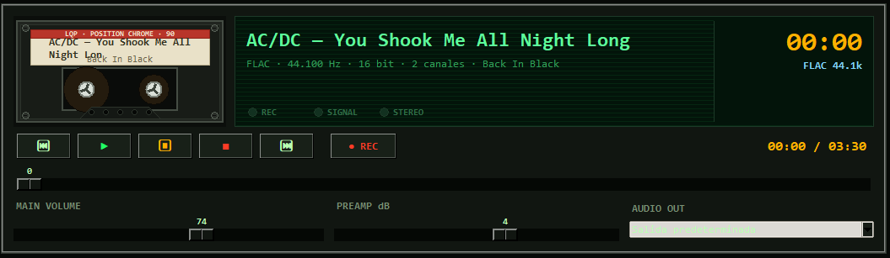

El cassette gira mientras hay reproducción. En archivos locales, la cantidad de cinta en cada carrete representa el avance aproximado del tema.

### Controles

- `⏮`: pista o radio anterior.
- `▶`: reproducir o continuar.
- `⏸`: pausar.
- `■`: detener.
- `⏭`: pista o radio siguiente.
- `● REC`: iniciar o detener una grabación de radio.

### Línea de tiempo

En archivos locales, la barra permite avanzar o retroceder dentro del tema. En radio, la reproducción es en vivo y no se puede buscar un punto anterior.

### Volumen y preamplificador

- **MAIN VOLUME** controla el nivel de salida general.
- **PREAMP dB** aumenta o reduce el nivel antes de las etapas finales.

Si el indicador de clip se enciende, bajá primero el preamplificador, el Power Stage o las bandas de EQ que tengan grandes aumentos.

## 6. Selección de salida de audio

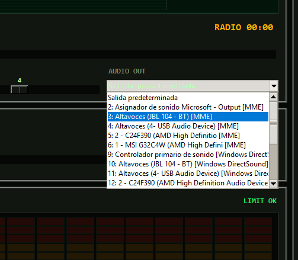

El menú **AUDIO OUT** muestra los dispositivos de salida detectados por SoundDevice y las APIs de audio disponibles en Windows.

La opción **Salida predeterminada** sigue el dispositivo configurado como principal en Windows. Para usar auriculares, una interfaz USB, HDMI o una salida específica, elegila en el desplegable.

Al cambiar de dispositivo durante la reproducción, la aplicación vuelve a abrir el stream de salida. Puede escucharse una pausa breve.

## 7. Ecualizador manual de 10 bandas

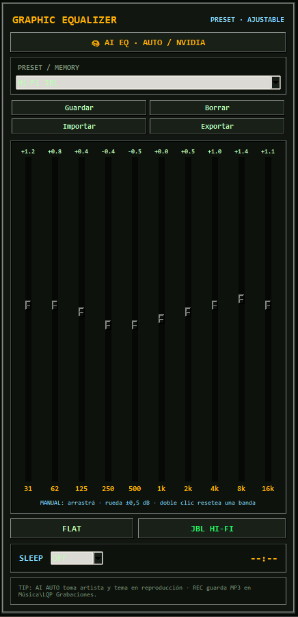

El ecualizador procesa diez bandas centrales:

| Banda | Zona aproximada | Efecto habitual |
|---|---|---|
| 31 Hz | Subgrave | Vibración profunda; muchos parlantes chicos casi no la reproducen |
| 62 Hz | Grave profundo | Golpe de bombo y peso del bajo |
| 125 Hz | Grave | Cuerpo y calidez |
| 250 Hz | Bajo medio | Cuerpo; demasiado puede sonar embarrado |
| 500 Hz | Medio bajo | Densidad y carácter de caja |
| 1 kHz | Medio | Presencia general de voces e instrumentos |
| 2 kHz | Medio alto | Definición, ataque e inteligibilidad |
| 4 kHz | Presencia | Claridad y detalle; exceso puede cansar |
| 8 kHz | Agudo | Brillo, platos y aire cercano |
| 16 kHz | Aire | Sensación de apertura, según equipo y grabación |

### Controles por banda

- Arrastrá la palanca para modificar la ganancia.
- Usá la rueda del mouse para cambios de 0,5 dB.
- Hacé doble clic para devolver una sola banda a 0 dB.

Los cambios se aplican en tiempo real. Las palancas siguen siendo editables después de aplicar un preset, una memoria o una curva generada por AI EQ.

### Recomendaciones

- Empezá con cambios de entre 0,5 y 2 dB.
- Antes de aumentar muchas bandas, probá bajar las que molestan.
- Si levantás graves o agudos, bajá un poco el preamplificador para conservar margen dinámico.
- En monitores chicos, aumentar mucho 31 Hz suele gastar headroom sin producir graves reales.

## 8. Presets y MEMORY EQ

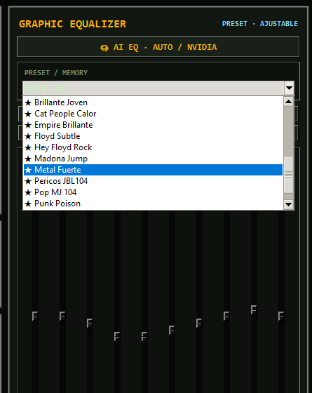

El desplegable incluye presets de fábrica y memorias creadas por el usuario.

### Aplicar un preset

1. Elegí el nombre en la lista.
2. Presioná **Aplicar**.
3. Ajustá manualmente cualquier banda si querés personalizarlo.

### Guardar una memoria

1. Prepará la curva con las palancas o con AI EQ.
2. Presioná **Guardar**.
3. Escribí un nombre claro.
4. La memoria aparecerá marcada con una estrella.

### Borrar, importar y exportar

- **Borrar** elimina una memoria propia; los presets de fábrica no se borran.
- **Importar** incorpora curvas desde JSON.
- **Exportar** guarda tus memorias en JSON para copia de seguridad o traslado a otra PC.

## 9. AI EQ con NVIDIA

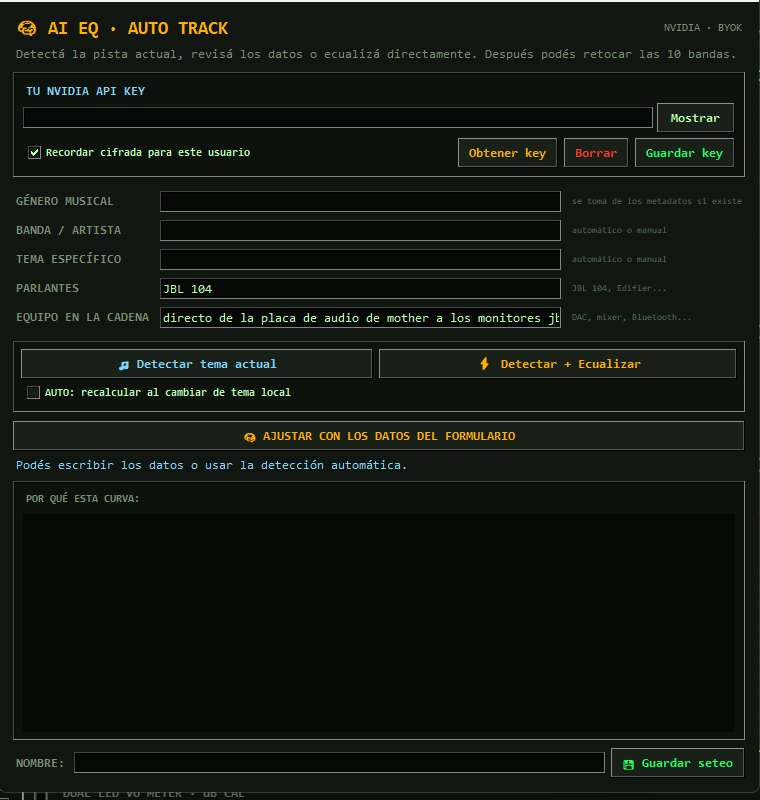

AI EQ consulta un modelo de NVIDIA NIM para proponer una curva de diez bandas según la música y el equipo informado. La curva se aplica como punto de partida y siempre puede retocarse manualmente.

### 9.1 Obtener una API key

1. Abrí el catálogo de modelos de NVIDIA en `https://build.nvidia.com/`.
2. Iniciá sesión o creá una cuenta NVIDIA.
3. Abrí la página de un modelo con endpoint de API. La aplicación utiliza el modelo indicado en su código y puede actualizarse en versiones futuras.
4. Presioná **Generate API Key** o **Get API Key**.
5. Copiá la clave y guardala en un lugar seguro.
6. Pegala en el campo **TU NVIDIA API KEY** dentro de LQP HiFi Rack Player.

No publiques la clave en GitHub, capturas, mensajes o archivos compartidos. NVIDIA indica que la clave está vinculada a la cuenta y debe mantenerse secreta.

### 9.2 Guardado seguro

- **Usar solo durante esta sesión**: la clave se mantiene en memoria y desaparece al cerrar.
- **Recordar cifrada para este usuario**: en Windows, la clave se protege mediante DPAPI y queda vinculada a la cuenta de Windows actual.
- **Borrar clave**: elimina el valor guardado por la aplicación.

También se puede definir la variable de entorno `NVIDIA_API_KEY`. El repositorio nunca debe contener una clave real.

### 9.3 Campos del formulario

- **Género musical**: rock, jazz, electrónica, tango, pop, etc.
- **Banda / artista**: intérprete principal.
- **Tema específico**: nombre de la canción.
- **Parlantes**: modelo o descripción de los altavoces.
- **Equipo en la cadena**: DAC, amplificador, mixer, Bluetooth u otros elementos relevantes.

### 9.4 Detectar tema actual

El botón de detección completa automáticamente los datos sin consultar todavía a NVIDIA.

La aplicación busca información en este orden:

1. Metadatos embebidos del archivo.
2. Artista y título ya cargados en el motor.
3. Interpretación del nombre del archivo, por ejemplo `Artista - Tema.mp3`.
4. Pista seleccionada en la playlist, aunque todavía no esté sonando.

Cuando falta un dato, podés completarlo o corregirlo antes de pedir la curva.

### 9.5 Detectar + Ecualizar

Este modo detecta los datos disponibles, envía la consulta a NVIDIA en segundo plano y aplica las diez ganancias recibidas.

Durante la consulta podés seguir usando la interfaz. La respuesta puede tardar según la disponibilidad del endpoint y la conexión.

### 9.6 AUTO al cambiar de tema

Al activar esta opción, cada pista local nueva dispara una detección y una nueva consulta. El modo:

- No se aplica automáticamente a radios, porque muchas emisoras no entregan el título real del tema.
- Requiere una API key válida.
- Puede consumir cuota o créditos del servicio de NVIDIA.
- Mantiene las palancas disponibles para retoque manual.

### 9.7 Interpretar la curva

La sección **POR QUÉ ESTA CURVA** resume el criterio propuesto. Tomalo como recomendación, no como medición acústica de la habitación. La API no escucha el audio ni mide tus parlantes: trabaja con metadatos y la descripción escrita del equipo.

Para una corrección acústica precisa se necesita un micrófono de medición y software especializado.

## 10. Power Stage DSP

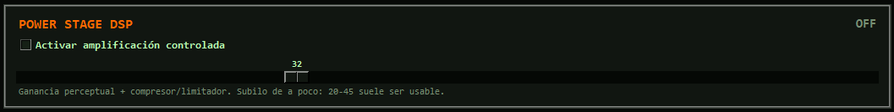

Power Stage agrega ganancia perceptual y controla picos mediante compresión, limitación y soft clipping.

- Activá **amplificación controlada**.
- Subí el porcentaje de a poco.
- Un rango moderado suele dar más presencia sin aplastar demasiado la dinámica.
- Si aparece clip o fatiga, bajá Power, Preamp o volumen.

Este control no aumenta la potencia física del amplificador ni la capacidad real de los parlantes. Solo procesa la señal digital.

## 11. Spectrum Analyzer y VU Meter

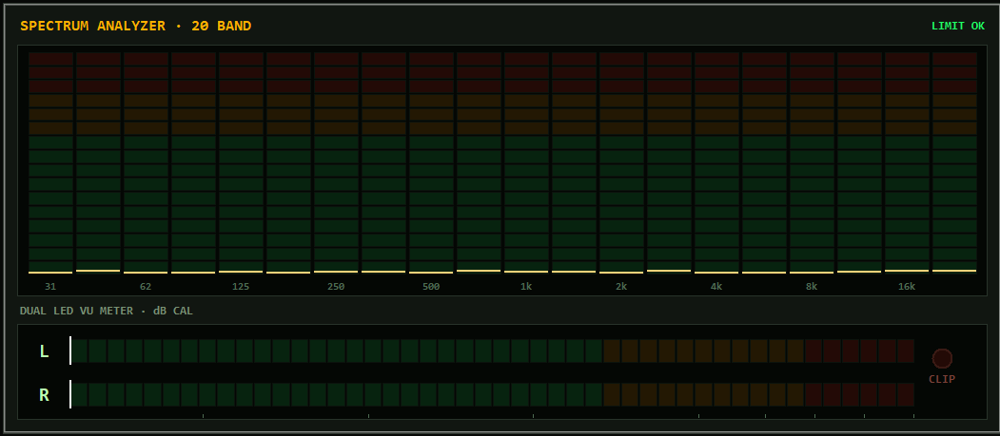

### Spectrum Analyzer

El analizador divide la señal en veinte bandas y muestra la energía aproximada en tiempo real. Los marcadores superiores conservan los picos durante un breve período.

### VU Meter

Las barras L y R representan los canales izquierdo y derecho. El indicador de clip se activa cuando la señal se acerca al límite digital.

- Verde: rango normal.
- Ámbar: nivel alto.
- Rojo: riesgo de limitación o clipping.

## 12. Radio FM Argentina

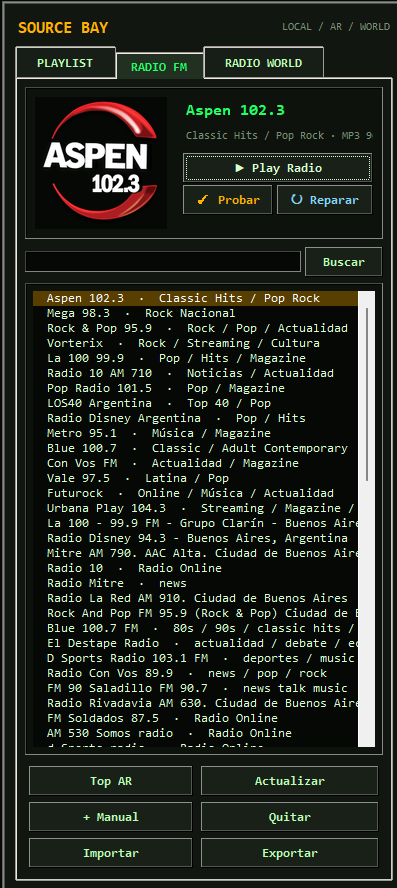

La pestaña **RADIO FM** incluye emisoras argentinas preconfiguradas y resultados de Radio-Browser.

### Funciones

- **Play Radio**: abre la emisora elegida.
- **Probar stream**: verifica con FFmpeg si la URL entrega audio.
- **Reparar**: busca una URL actualizada para una estación que dejó de funcionar.
- **Top AR**: carga emisoras argentinas populares desde Radio-Browser.
- **Buscar**: encuentra estaciones por nombre.
- **+ Manual**: agrega una emisora ingresando nombre, género y URL.
- **Importar / Exportar**: trabaja con listas JSON o M3U.
- **Logos**: actualiza imágenes de las estaciones.

Los streams de radio pertenecen a terceros y pueden cambiar, bloquear regiones o salir del aire sin aviso.

## 13. Radio World

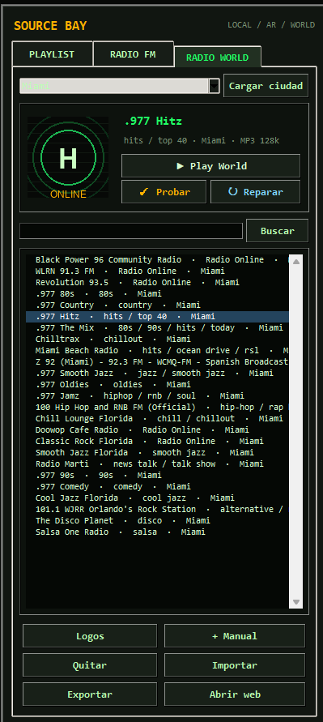

Radio World organiza búsquedas por ciudades importantes:

- Miami
- New York
- Ibiza
- Madrid
- London
- Paris
- Berlin
- Tokyo
- Rio de Janeiro
- Mexico City

Elegí una ciudad y presioná **Cargar ciudad**. La aplicación consulta Radio-Browser, prioriza estaciones destacadas y completa la lista con resultados regionales.

También podés buscar por nombre, género o palabra clave. Al igual que en Radio FM, una URL puede probarse, repararse, importarse o exportarse.

## 14. Grabación de radio

Con una emisora reproduciéndose, presioná `● REC` para iniciar una grabación. La captura se realiza mediante un proceso de FFmpeg independiente.

Las grabaciones se guardan, por defecto, en:

```text
%USERPROFILE%\Music\LQP Grabaciones
```

Presioná nuevamente el botón para detener y cerrar el MP3.

Antes de grabar o redistribuir una emisión, verificá la legislación y los términos aplicables en tu país. La función está pensada para uso personal permitido.

## 15. Sleep timer

El sleep timer pausa la reproducción después del período elegido. En los últimos segundos reduce progresivamente el volumen para producir un fade-out.

Opciones habituales: 15, 30, 45, 60 y 90 minutos.

## 16. Atajos de teclado

| Atajo | Acción |
|---|---|
| Espacio | Play / Pausa |
| Flecha derecha | Adelantar 10 segundos en archivo local |
| Flecha izquierda | Retroceder 10 segundos en archivo local |
| Flecha arriba | Subir volumen |
| Flecha abajo | Bajar volumen |
| Ctrl + O | Agregar archivos |
| Doble clic | Reproducir pista o radio seleccionada |

## 17. Configuración y datos locales

La configuración se guarda en una carpeta del perfil del usuario, normalmente:

```text
%LOCALAPPDATA%\LQP_HiFi_Rack_Player
```

Puede incluir:

- Playlist y orden.
- Volumen, preamp y Power Stage.
- Ganancias y memorias de EQ.
- Radios agregadas o reparadas.
- Ciudad seleccionada en Radio World.
- Dispositivo de salida.
- Tamaño y posición de la ventana.
- Blob protegido de la clave NVIDIA, cuando el usuario decide recordarla.

El archivo de configuración y las grabaciones no se incluyen en Git.

## 18. Buenas prácticas de audio

- Empezá con volumen bajo antes de activar Power Stage o aplicar curvas nuevas.
- Evitá sumar grandes aumentos simultáneos en EQ, preamp y Power.
- Observá el VU y el indicador de clip.
- No uses auriculares a niveles altos durante períodos prolongados.
- Una curva útil depende de la grabación, los parlantes, la habitación y el gusto personal.

## 19. Ayuda

Consultá [Solución de problemas](SOLUCION_DE_PROBLEMAS.md) para errores de audio, dependencias, FFmpeg, radios o API key.
